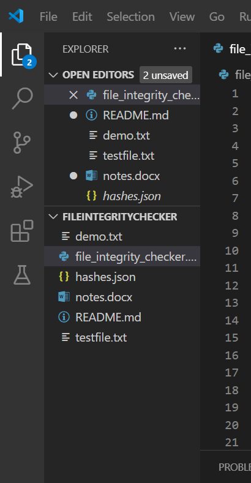

# 🔐 File Integrity Checker

A Python project to detect any changes in file content using hashing (SHA256). Useful for checking if a file has been tampered with.

---

## 📁 Files Used
- `file_integrity_checker.py` - The main code
- `testfile.txt` - Sample file for testing
- `notes.docx` - Another test file
- `hashes.json` - Stores original file hashes
- `README.md` - Project explanation

---

## 🧠 How It Works
1. Saves hash values of selected files using SHA256
2. Later compares current file hashes with saved ones
3. Detects and reports if any file is changed

---

## 📸 Screenshots

### 1. Full Python Code in VS Code)


---

### 2. Output in Terminal (Detects Changes)


---

### 3. File List in Project Explorer


---

### 4. README.md Preview


---

## 🚀 How to Use

```python
files_to_check = ['testfile.txt', 'notes.docx']
save_hashes(files_to_check)      # Saves file hashes
compare_hashes(files_to_check)   # Checks if files changed
